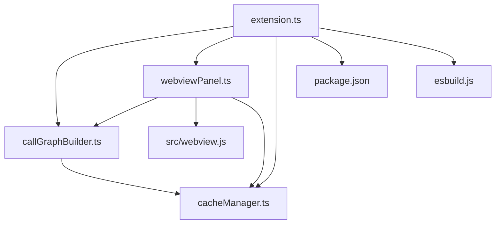
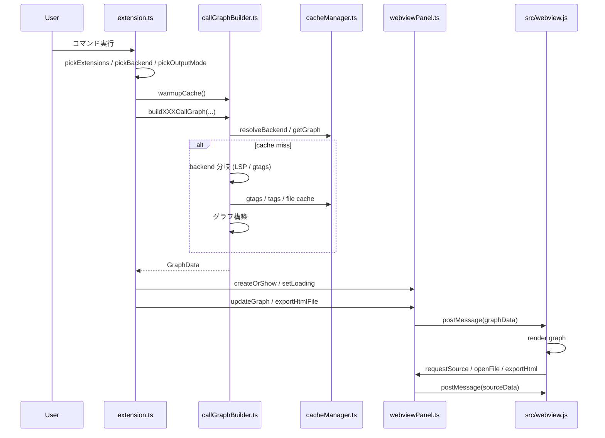

# Call Map VS Code Extension Architecture

## 概要

`call-map` は C/C++ のコールグラフを解析・可視化する VS Code 拡張です。  
LSP (clangd / C/C++ 拡張) と GNU GLOBAL (`gtags`) の両方をバックエンドとしてサポートし、ユーザーは実行時に切り替えられます。

主な機能:
- ワークスペース、フォルダ、ファイル、関数、パス貫通の各解析モード
- WebView 内でインタラクティブなグラフ表示
- HTML 形式でのエクスポート
- ファイル変更を検知してキャッシュを無効化
- マルチルートワークスペース対応
- セキュリティ強化: WebView からのファイルアクセスとパス検証

主要ファイル:
- `src/extension.ts`
- `src/callGraphBuilder.ts`
- `src/cacheManager.ts`
- `src/webviewPanel.ts`
- `src/webview.js`
- `package.json`
- `esbuild.js`

---

## 主要モジュール

- `src/extension.ts`
  - 拡張機能のエントリポイント
  - コマンド定義・登録
  - QuickPick UI
  - ファイル/フォルダ検出
  - `buildAndOutput()` による共通処理
  - `FileSystemWatcher` によるキャッシュ無効化

- `src/callGraphBuilder.ts`
  - コールグラフ生成ロジック
  - `buildFileCallGraph`, `buildWorkspaceCallGraph`, `buildFunctionCallGraph`, `buildPathThroughCallGraph`
  - LSP / gtags の切り替え
  - `resolveBackend()`, `warmupCache()`
  - 各バックエンド固有の最適化とバグ修正ロジック

- `src/cacheManager.ts`
  - グラフ結果キャッシュ
  - gtags タグキャッシュ
  - ファイル一覧キャッシュ
  - lazy キャッシュ
  - `gtags` 有効性キャッシュ

- `src/webviewPanel.ts`
  - `CallGraphPanel`
  - WebView HTML 生成
  - 拡張側 ⇄ WebView のメッセージ送受信
  - ソース遅延読み込み
  - HTML エクスポート

- `src/webview.js`
  - WebView 側フロントエンド
  - グラフ描画 / UI 操作
  - `vscode.postMessage()` で拡張機能と通信

- `package.json`
  - コマンド登録
  - キーバインド
  - メニュー表示
  - 設定定義

---

## モジュール依存図 (Mermaid)

---

## 処理シーケンス図 (Mermaid)

---

## コマンド一覧

`package.json` の `contributes.commands` で定義されたコマンド:

- `callgraph.showWorkspaceGraph`
  - タイトル: `Call Map: Analyze Workspace`
- `callgraph.showFolderGraph`
  - タイトル: `Call Map: Analyze Folder`
- `callgraph.showFileGraph`
  - タイトル: `Call Map: Show File Call Graph`
- `callgraph.showFunctionGraph`
  - タイトル: `Call Map: Show Function Graph (BFS)`
- `callgraph.showPathGraph`
  - タイトル: `Call Map: Show Path-Through Graph`

キーショートカット:
- `Ctrl+Alt+W`: workspace graph
- `Ctrl+Alt+M`: file graph
- `Ctrl+Alt+F`: function graph
- `Ctrl+Alt+P`: path graph

---

## WebView 連携

### 1. WebView の生成
- `src/webviewPanel.ts` の `CallGraphPanel.createOrShow()` で `vscode.window.createWebviewPanel()` を生成
- `enableScripts: true`
- `retainContextWhenHidden: true`

### 2. HTML / CSP
- `CallGraphPanel._buildHtml()` が HTML を生成
- `vis-network.min.js` と `webview.js` を WebView URI に変換して読み込み
- WebView 用 CSP を適用

### 3. 拡張 → WebView 通信
- `setLoading()`: `type: 'loading'`
- `updateGraph(data)`: `type: 'graphData'`
- `showError(msg)`: `type: 'error'`

### 4. WebView → 拡張通信
`src/webview.js` から送信:
- `type: 'ready'`
- `type: 'openFile'`
- `type: 'requestSource'`
- `type: 'exportHtml'`

`webviewPanel.ts` では受信して:
- ソースリクエストを処理
- ファイルを開く
- HTML エクスポートを実行

### 5. セキュリティ
`webviewPanel.ts` は次を採用:
- `resolveAndNormalize()` で実パス解決
- `isPathInWorkspace()` で workspace 内確認
- `allowedFiles` セットで WebView から要求できるファイルを制限
- `escapeHtmlForTitle()` で XSS 防止

---

## GTAGS 連携

### バックエンド選択
- `extension.ts` の `pickBackend()` で `callmap.defaultBackend` を反映
- `ask` の場合はユーザーに選択させる
- `lsp` / `gtags` 固定の場合は QuickPick をスキップ

### 可用性判定
- `callGraphBuilder.ts` の `resolveBackend('auto')`
- `gtagsAvailable()` で `gtags --version` を実行
- 使用可否結果を `CacheManager` でキャッシュ

### 初期ウォームアップ
- `warmupCache(document, backend)`
- `gtags` なら `ensureGtagsDb(wsRoot)` + `collectGtagsCached(wsRoot)`
- `lsp` なら `vscode.executeDocumentSymbolProvider`

### gtags 解析の要点
- `ensureGtagsDb()` が `GTAGS` を初期化/更新
- `collectGtagsCached()` が `global -x -e '.'` をキャッシュ
- `buildEdgesGlobalRx()` が `global -rx` を使い edge を構築
- `runGlobalXNames()` / `runGlobalRxBatch()` でバッチクエリ
- `buildWorkspaceCallGraphGtags()` でマルチルート対応
- `buildFunctionCallGraphGtags()` で遅延ロード + BFS
- `buildPathThroughCallGraphGtags()` で上下方向パス解析

---

## 拡張起動からコールグラフ表示までの流れ

1. VS Code が拡張を activate
   - `src/extension.ts` の `activate(context)`
   - `FileSystemWatcher` とコマンド登録を行う

2. ユーザーがコマンドを実行
   - 例: `callgraph.showFileGraph`

3. 拡張が設定値と選択 UI を処理
   - `pickExtensions()`
   - `pickBackend()`
   - `pickOutputMode()`

4. 初期ウォームアップ
   - `warmupCache()` が `gtags` DB 更新または LSP シンボル取得を行う

5. グラフ生成
   - `buildAndOutput()` が `buildXXXCallGraph(...)` を呼ぶ
   - `callGraphBuilder.ts` で backend を解決
   - キャッシュ確認後、必要なら `LSP` / `gtags` で解析

6. 表示 / HTML エクスポート
   - `mode === 'webview'` なら `CallGraphPanel.createOrShow()` で表示
   - `mode === 'html'` なら `CallGraphPanel.exportHtmlFile()`

---

## 今後機能追加する際に編集すべきファイル

1. `src/extension.ts`
   - 新コマンド追加
   - 実行フロー / QuickPick / ファイル検索

2. `package.json`
   - コマンド・メニュー・設定追加

3. `src/callGraphBuilder.ts`
   - 新しい解析モード
   - LSP/gtags 解析ロジック
   - 新たなキャッシュキー・最適化

4. `src/cacheManager.ts`
   - キャッシュ種別や無効化ロジックの追加

5. `src/webviewPanel.ts`
   - WebView 表示の強化
   - WebView ⇄ 拡張通信の拡張

6. `src/webview.js`
   - グラフ UI / インタラクションの追加
   - type: 'requestSource', 'openFile' などの対応追加

7. `esbuild.js`
   - ビルド生成ファイルの変更や WebView リソース追加

---

## 参考

- `src/extension.ts`
- `src/callGraphBuilder.ts`
- `src/cacheManager.ts`
- `src/webviewPanel.ts`
- `src/webview.js`
- `package.json`
